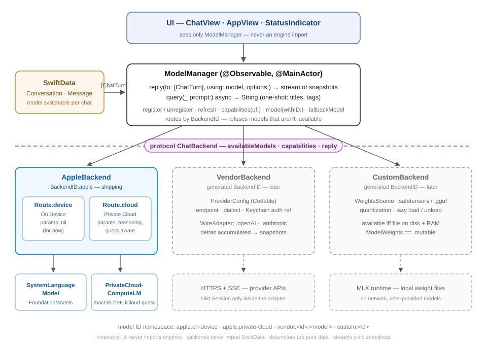
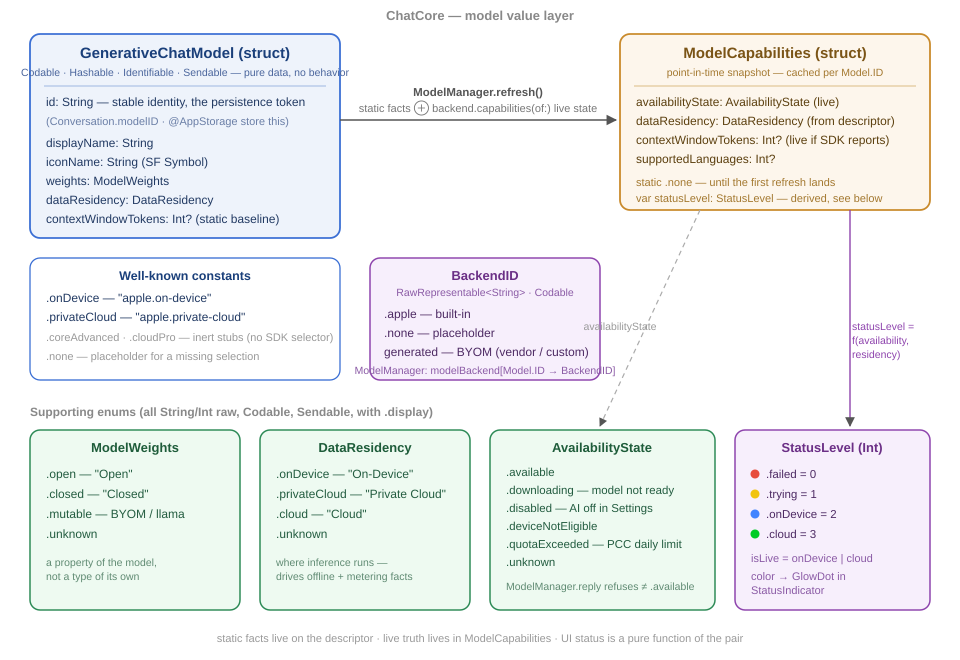

# ChatCore Backend Design

*The middle layer between the app and every model provider — one set of
methods, many families of models.*



## The one interface

Everything above the seam talks to `ModelManager`. It exposes exactly two
operations (plus housekeeping):

| Spec name | Method | Shape |
| --- | --- | --- |
| Request model → get response | `reply(to:using:options:)` | streaming, multi-turn |
| Query | `query(_:using:options:)` | one-shot, awaitable string |

```swift
@Observable @MainActor
final class ModelManager {
    // Published state the UI reads
    private(set) var chatModels: [GenerativeChatModel]
    private(set) var capabilities: [GenerativeChatModel.ID: ModelCapabilities]

    // 1. Request model → get response (streaming, conversation-shaped)
    func reply(
        to turns: [ChatTurn],
        using model: GenerativeChatModel,
        options: ChatOptions = .default
    ) -> AsyncThrowingStream<String, Error>

    // 2. Query (one-shot: titles, tags, summaries — no conversation)
    func query(
        _ prompt: String,
        using model: GenerativeChatModel? = nil,   // nil → fallbackModel
        options: ChatOptions = .default
    ) async throws -> String

    // Housekeeping
    func register(_ backend: any ChatBackend)
    func unregister(_ id: BackendID)
    func refresh() async
    func model(withID: GenerativeChatModel.ID?) -> GenerativeChatModel?
}
```

`query` is sugar over `reply` — drain the stream, return the last snapshot.
One code path to debug.

## The seam

Every provider family implements the same protocol. Nothing above it ever
imports FoundationModels, URLSession specifics, or MLX; nothing below it
ever imports SwiftData.

```swift
protocol ChatBackend: Sendable {
    var id: BackendID { get }
    func availableModels() async throws -> [GenerativeChatModel]
    func capabilities(of model: GenerativeChatModel) async -> ModelCapabilities
    func reply(
        to turns: [ChatTurn],
        model: GenerativeChatModel,
        options: ChatOptions
    ) -> AsyncThrowingStream<String, Error>
}
```

Wire-neutral value types cross the seam:

```swift
struct ChatTurn: Sendable {                 // Message (SwiftData) → ChatTurn
    enum Role: String, Sendable { case system, user, assistant }
    var role: Role
    var content: String
}

struct ChatOptions: Sendable {              // each backend maps to its wire format
    var temperature: Double = 1.0
    var maxResponseTokens: Int? = nil
    var reasoningEffort: ReasoningEffort = .none   // task #12, Apple Cloud only
}

enum ReasoningEffort: String, Codable, Sendable {
    case none, light, moderate, deep        // Apple → ContextOptions(reasoningLevel:)
}
```

## Family 1 — Apple (shipping)

One backend, two routes. The route is an enum so "which engine" is a typed
decision, not string comparison scattered through the file.

```swift
struct AppleBackend: ChatBackend {
    let id = BackendID.apple

    /// Where a descriptor routes. Derived from GenerativeChatModel.id.
    enum Route: Sendable {
        case device(DeviceParams?)   // nil for now — SystemLanguageModel.default
        case cloud(CloudParams)      // PrivateCloudComputeLanguageModel

        struct DeviceParams: Sendable {
            // future: adapter (fine-tune), variant selector if Apple ships one
        }
        struct CloudParams: Sendable {
            var reasoning: ReasoningEffort = .none
            // future: tier, image input
        }
    }
}
```

Vends: `.onDevice` ("apple.on-device") and `.privateCloud`
("apple.private-cloud"). Cloud availability additionally reflects the
per-user iCloud quota (`quotaExceeded`).

## Family 2 — Vendor (later)

BYOM providers reached over HTTPS. One backend struct, parameterized by a
persisted config and a wire dialect — adding Anthropic vs. OpenAI is a new
adapter, not a new backend.

```swift
struct ProviderConfig: Codable, Identifiable, Sendable {
    enum Kind: String, Codable { case apple, vendor, custom }
    var id: BackendID              // generated at creation, stable forever
    var kind: Kind
    var displayName: String        // "Work Anthropic", "Local Ollama"
    var endpoint: URL?
    var dialect: WireDialect?
    var authKeychainRef: String?   // Keychain key — never the secret itself
}

enum WireDialect: String, Codable, Sendable { case openAI, anthropic }

struct VendorBackend: ChatBackend {
    let config: ProviderConfig
    let adapter: any WireAdapter
}

/// Maps seam types ↔ one provider's HTTP shape.
protocol WireAdapter: Sendable {
    func request([ChatTurn], GenerativeChatModel, ChatOptions) throws -> URLRequest
    func delta(fromSSELine: Data) throws -> String?   // adapter emits deltas;
}                                                     // VendorBackend accumulates
                                                      // → yields snapshots, matching
                                                      // the seam contract
```

## Family 3 — Custom (open weights, later)

Locally loaded open-source weights. Availability is physical: file present,
enough RAM. Loads lazily, unloads under memory pressure.

```swift
struct WeightsSource: Codable, Sendable {
    var url: URL                   // .safetensors / .gguf on disk
    var quantization: String?      // "q4", "bf16", …
    var runtime: Runtime
    enum Runtime: String, Codable, Sendable { case mlx /*, llamaCpp */ }
}

final class CustomBackend: ChatBackend {   // class: owns a loaded model's lifetime
    let config: ProviderConfig
    let weights: WeightsSource
    // capabilities: .available iff file exists && RAM headroom
    // ModelWeights == .mutable — the one family where weights are user-swappable
}
```

## Registration & identity

```swift
// App launch
manager.register(AppleBackend())                      // built-in, always
for config in providerStore.configs {                 // user-added, persisted
    switch config.kind {
    case .vendor: manager.register(VendorBackend(config: config, adapter: config.dialect!.adapter))
    case .custom: manager.register(CustomBackend(config: config, weights: ...))
    case .apple:  break
    }
}
await manager.refresh()
```

Model ID namespace (the persistence token in `Conversation.modelID`):

```text
apple.on-device            apple.private-cloud
vendor.<backend-uuid>.<provider-model-id>
custom.<backend-uuid>
```

## Selection semantics — placement, not model

The user picks **where** inference runs; Apple picks **which weights** answer
within that placement (Core vs. Core Advanced is routed by hardware,
transparently). The UI must never promise model-level precision it doesn't
have.

Rules:

1. **The picker offers routes, not models.** Two entries: *On Device* and
   *Private Cloud*. Subtitle copy carries the stable tradeoffs — facts that
   stay true no matter which AFM variant serves the request:

   | Route | Subtitle |
   | --- | --- |
   | On Device | Private · works offline · no limits |
   | Private Cloud | Larger model · needs network · daily limit |

2. **IDs name routes.** `"apple.on-device"` and `"apple.private-cloud"` are
   persistence tokens for a *placement*, so a locked conversation stays
   truthful across OS upgrades that swap the backing model. This is why
   `AppleBackend.Route` is the routing type — variants are params, not routes.

3. **What you actually got is reported, not chosen.** The status-light
   popover shows live facts downstream of the choice: `contextSize`
   (4,096 reads Core-class, 8,192 Advanced-class hardware) plus a
   "Variant · chosen by Apple" row — honest about adaptivity, promises
   nothing.

4. **If Apple ships a variant selector**, it becomes a parameter on
   `Route.device` (e.g. a "prefer advanced" toggle at conversation
   creation) — not a third picker entry.

5. **Unknowable facts stay unknown.** The on-device descriptor's
   `weights` is `.unknown` — we can't know which weights answered.

Precedent: Apple's own Shortcuts "Use Model" action offers On-Device /
Private Cloud Compute / ChatGPT — placements and providers, never AFM names.

## Model value layer



`GenerativeChatModel` is a pure descriptor — data about a model, never
behavior. Static facts (weights, residency, baseline context window) live on
the descriptor; live truth (availability, quota, real context size) arrives
via `backend.capabilities(of:)` and is cached as `ModelCapabilities` keyed by
model ID. UI status is a pure function of the pair:
`(availabilityState, dataResidency) → StatusLevel → GlowDot color`. The
model's `id` string is the only thing that ever gets persisted; everything
else is resolvable from it at runtime.

## Invariants

1. UI never imports FoundationModels/URLSession/MLX — only `ModelManager`.
2. Backends never import SwiftData — they see `[ChatTurn]`, nothing else.
3. Model descriptors are pure data (`GenerativeChatModel`); behavior lives
   in the backend that vended them, found via `BackendID`.
4. A conversation's model is switchable mid-chat (sessions rebuild per
   send, so the next reply just routes differently); generation params
   (temperature, max tokens) stay locked at creation. A vanished model
   resolves to `fallbackModel` at send time. New chats lock to the
   user's default (`@AppStorage("defaultModelID")`, set via the badge
   menu's check).
5. Streams yield cumulative snapshots, not deltas (FoundationModels
   convention; vendor adapters accumulate to match).

## Session state — history is a transcript, not instructions

The seam hands a backend the whole conversation on every send, but only the last
turn is new. `AppleBackend` therefore prompts with that turn alone and supplies
the rest as a `Transcript`, kept per conversation by `TranscriptStore`
(`ChatOptions.sessionKey` carries the conversation's UUID across the seam — a
bare UUID, so the no-SwiftData-below-the-seam invariant holds and stateless
backends can ignore it).

Two reasons, in order of importance:

1. **Instructions are not a transcript.** Instructions are the app speaking and
   carry standing a prompt does not. Replaying history through them promotes
   whatever the user typed three turns ago to the same authority as the app's
   own rules. Only genuine `system` turns fold into the instructions entry now;
   user and assistant turns become `prompt` and `response` entries.
2. **A rebuilt prefix is an unrecognizable one.** Re-serializing history each
   send gives the runtime no prefix it can match against the one it just read.

The cache is an optimization that can never be a correctness risk: an entry is
used only while its fingerprint still matches the exact turns preceding this
send. An edited message, a deleted one, a relaunch, or a model switched mid-chat
all miss and rebuild from turns, which remain the source of truth. Keys include
the route, because reasoning entries from Private Cloud mean nothing to the
on-device model. A failed or cancelled turn invalidates its entry rather than
leaving the next send to build on a response nothing finished.

Context overflow is handled where the numbers are: `LanguageModelError`
`.contextSizeExceeded` carries `contextSize` and `tokenCount`, so the recovery
sheds that many tokens' worth of the oldest entries — whole entries, instructions
pinned — and retries once. The retry is skipped if any token already reached the
screen, since restarting a visible answer mid-sentence is worse than the error.
Summarizing the shed span via `query` is the natural next iteration.

## Open questions

- Does `Route.device` ever grow a variant selector (Core Advanced), or does Apple route transparently?
- Should `ClaudeBackend` move to the same transcript-shaped history, or does the
  Anthropic wire format make `historyInstructions` the right shape there?
- ADM-style image models: separate `ImageBackend` protocol, not this seam.
